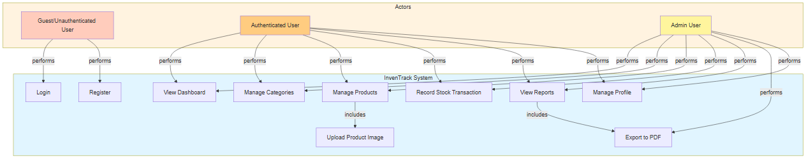
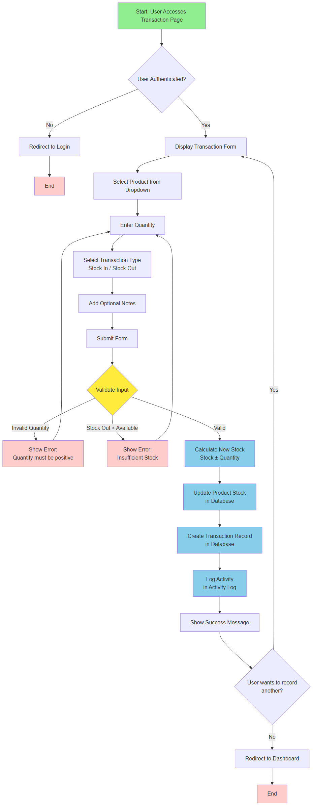
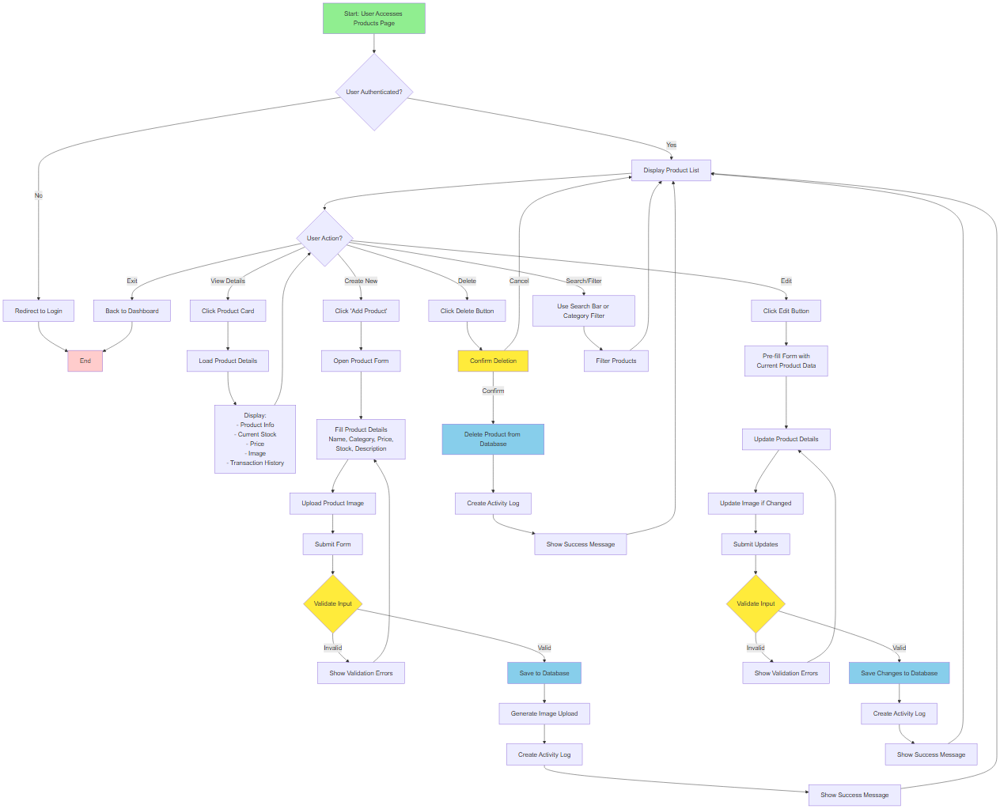
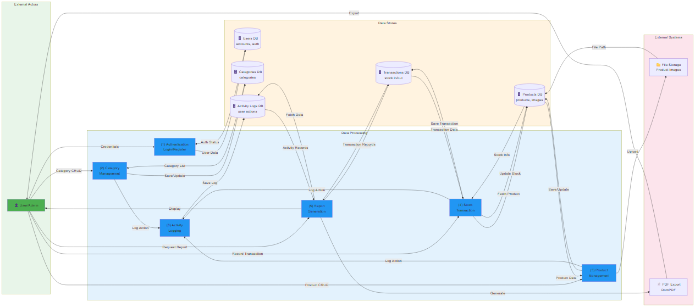
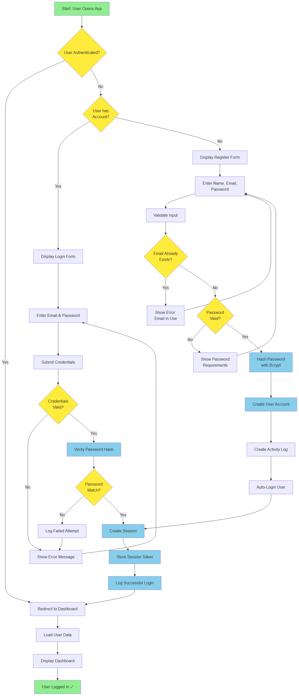

# UML Diagrams & Data Flow Documentation

Dokumentasi lengkap untuk Use Case Diagram, Activity Diagram, dan Data Flow Diagram (pengganti DFD) untuk sistem InvenTrack.

---

## 1. Use Case Diagram

### Overview

Use Case Diagram menunjukkan interaksi antara Actors (pengguna) dan System (aplikasi) dengan semua use cases yang tersedia.

### Diagram



**Generated with Mermaid - Professional UML Standard**

### Actors (Aktor)

1. **Guest/Unauthenticated User**
    - User yang belum login
    - Dapat melakukan: Login, Register

2. **Authenticated User**
    - User yang sudah login
    - Dapat melakukan: Dashboard, Manajemen Kategori, Manajemen Produk, Recording Transaksi, View Reports, Manajemen Profil

3. **Admin User**
    - User dengan akses penuh
    - Semua akses user + Export PDF

### Use Cases (Kasus Penggunaan)

| Use Case               | Actor      | Deskripsi                             |
| ---------------------- | ---------- | ------------------------------------- |
| **Login**              | Guest      | User login dengan email & password    |
| **Register**           | Guest      | User membuat akun baru                |
| **View Dashboard**     | User/Admin | Melihat statistik & ringkasan data    |
| **Manage Categories**  | User/Admin | Create, Read, Update, Delete kategori |
| **Manage Products**    | User/Admin | CRUD produk, upload gambar            |
| **Upload Image**       | User/Admin | Upload gambar produk (include)        |
| **Record Transaction** | User/Admin | Recording stok masuk/keluar           |
| **View Reports**       | User/Admin | Melihat laporan & aktivitas           |
| **Export to PDF**      | Admin      | Export laporan ke PDF                 |
| **Manage Profile**     | User/Admin | Update profil & password              |

### Include & Extend

- **Manage Products** → **Upload Image** (Include: wajib ada)
- **View Reports** → **Export to PDF** (Include: optional)

---

## 2. Activity Diagram - Stock Transaction Recording

### Overview

Activity Diagram menunjukkan alur aktivitas step-by-step ketika user melakukan recording transaksi stok.

### Diagram



**Generated with Mermaid - Professional UML Standard**

### Alur Transaksi Stok

#### 1. **Start - Access Transaction Form**

- User membuka halaman transaksi
- System memverifikasi autentikasi
- Jika belum login → redirect ke login page

#### 2. **Filling Transaction Data**

- Select Product dari dropdown
- Enter Quantity (jumlah)
- Select Transaction Type (Stok In / Stok Out)
- Add Notes (optional)
- Submit Form

#### 3. **Validation**

- ✓ Quantity harus positif
- ✓ Untuk Stok Out: Quantity tidak boleh melebihi stock yang tersedia
- ✗ Jika invalid → show error message & kembali ke form

#### 4. **Database Operations**

- Calculate new stock: `current_stock ± quantity`
- Update Product stock di database
- Create Transaction record dengan detail lengkap
- Create Activity Log entry

#### 5. **Response to User**

- Show success message
- Ask if user mau record lagi atau redirect ke dashboard

#### 6. **Decision Point**

- Record another? → Back to step 2
- No → Redirect to Dashboard

---

## 3. Activity Diagram - Product Management

### Overview

Activity Diagram untuk manajemen produk dengan operasi CRUD lengkap.

### Diagram



**Generated with Mermaid - Professional UML Standard**

### CRUD Operations

#### 1. **View Product List**

- Display semua products
- Show search & filter options
- Each product card shows: image, name, price, stock status

#### 2. **View Product Details**

- Click pada product card
- Load detail page dengan:
    - Product info lengkap
    - Current stock level
    - Price & description
    - Product image
    - Transaction history

#### 3. **Create New Product**

- Click "Add Product" button
- Fill form: Name, Category, Price, Stock, Description
- Upload product image
- Form validation
- Save to database
- Create activity log
- Show success message

#### 4. **Edit Product**

- Click edit button
- Form pre-fill dengan data saat ini
- Update product details
- Update image jika ada perubahan
- Form validation
- Save changes
- Create activity log

#### 5. **Delete Product**

- Click delete button
- Confirmation dialog
- If confirmed → delete dari database
- Create activity log
- Show success message

#### 6. **Search/Filter**

- Use search bar → search by product name
- Use category filter → filter by category
- Real-time update of product list

---

## 4. Data Flow Diagram (DFD Replacement)

### Overview

Data Flow Diagram (menggunakan Flowchart style) menunjukkan alur data dari actors ke processes ke data stores.

### Diagram



**Generated with Mermaid - Professional UML Standard**

### Komponen DFD

#### **External Actors (External Entities)**

- 👤 **User/Admin** - Pengguna sistem

#### **Data Processing (6 Main Processes)**

1. **(1) Authentication** - Login/Register user
2. **(2) Category Management** - CRUD kategori
3. **(3) Product Management** - CRUD produk
4. **(4) Stock Transaction** - Recording stok in/out
5. **(5) Report Generation** - Generate laporan
6. **(6) Activity Logging** - Log semua aktivitas user

#### **Data Stores (Database)**

- 🗄️ **Users DB** - User accounts & authentication
- 🗄️ **Categories DB** - Kategori produk
- 🗄️ **Products DB** - Data produk & images
- 🗄️ **Transactions DB** - History stok in/out
- 🗄️ **Activity Logs DB** - User action logs

#### **External Systems**

- 📁 **File Storage** - Menyimpan product images
- 📄 **PDF Export** - DomPDF untuk export laporan

### Data Flows (Alur Data)

```
User → (1) Authentication → Users DB
       ↓
       → (2) Category Management → Categories DB
       ↓
       → (3) Product Management → Products DB
       ↓  (+ File Storage untuk images)
       → (4) Stock Transaction → Transactions DB
       ↓
       (4) → (6) Activity Logging → Activity Logs DB
       ↓
       (3) → (6) Activity Logging → Activity Logs DB
       ↓
       (2) → (6) Activity Logging → Activity Logs DB
       ↓
       → (5) Report Generation → Transactions DB + Activity Logs DB
       ↓
       → PDF Export → User
```

---

## 5. Authentication Flow Diagram

### Overview

Flowchart untuk proses login dan registrasi dengan validasi lengkap.

### Diagram



**Generated with Mermaid - Professional UML Standard**

### Login Flow

```
User Opens App
    ↓
Is User Authenticated?
├─ YES → Redirect to Dashboard
└─ NO → Check if has account
    ├─ YES → Login Form
    │   └─ Enter email & password
    │   └─ Validate credentials
    │   ├─ INVALID → Show error, retry
    │   └─ VALID → Verify password hash
    │       ├─ MATCH → Create session
    │       │   └─ Store session token
    │       │   └─ Log successful login
    │       │   └─ Redirect to Dashboard
    │       └─ NO MATCH → Log failed attempt
    │           └─ Show error, retry
    └─ NO → Register Form
        └─ Enter name, email, password
        └─ Validate input
        ├─ Email exists → Show error
        ├─ Password invalid → Show requirements
        └─ Valid → Hash password (Bcrypt)
            └─ Create user account
            └─ Create activity log
            └─ Auto-login
            └─ Redirect to Dashboard
```

### Keamanan Authentication

- ✓ Password di-hash menggunakan **Bcrypt** (12 rounds)
- ✓ Session storage di **database**
- ✓ Password validation dengan strong requirements
- ✓ Email uniqueness validation
- ✓ Failed login attempts logging
- ✓ Secure password reset flow

---

## Color Legend

### Diagram Colors

- 🟢 **Green** - Start/Success states
- 🔵 **Blue** - Processing/Database operations
- 🟡 **Yellow** - Decision points
- 🔴 **Red** - Error/End states
- 🟣 **Purple** - System/External entities

---

## Summary Table

| Diagram                    | Tujuan                              | Coverage                     |
| -------------------------- | ----------------------------------- | ---------------------------- |
| **Use Case**               | Menunjukkan interaksi user & system | 10 use cases, 3 actors       |
| **Activity - Transaction** | Alur recording stok transaksi       | Validation & DB operations   |
| **Activity - Product**     | Alur manajemen produk CRUD          | Create, read, update, delete |
| **Data Flow**              | Alur data antar sistem              | 6 processes, 5 data stores   |
| **Authentication**         | Flow login & register               | Validation & security        |

---

## Best Practices untuk Diagrams

### 1. **Use Case Diagram**

- ✓ Fokus pada user perspective, bukan technical implementation
- ✓ Include actors dan relationships
- ✓ Use include/extend untuk menunjukkan dependencies

### 2. **Activity Diagram**

- ✓ Show sequential & parallel activities
- ✓ Include decision points & alternative flows
- ✓ Show start/end states
- ✓ Use swimlanes jika ada multiple actors

### 3. **Data Flow Diagram**

- ✓ Show data movement, bukan control flow
- ✓ Identify all processes, actors, data stores
- ✓ Label semua data flows
- ✓ Avoid detailed internal logic

---

## Untuk Update Diagrams

Jika ada perubahan fitur:

1. Update diagram di `docs/UML_DIAGRAMS.md`
2. Regenerate image menggunakan Mermaid syntax
3. Update entsprechend documentation
4. Commit changes dengan message: `docs: update UML diagrams`

---

## References

- **UML Standards**: Unified Modeling Language v2.5
- **Diagram Types**: Use Case, Activity, DFD (Data Flow Diagram)
- **Tools**: Mermaid.js untuk diagram generation
- **Best Practices**: Object Management Group (OMG) guidelines
