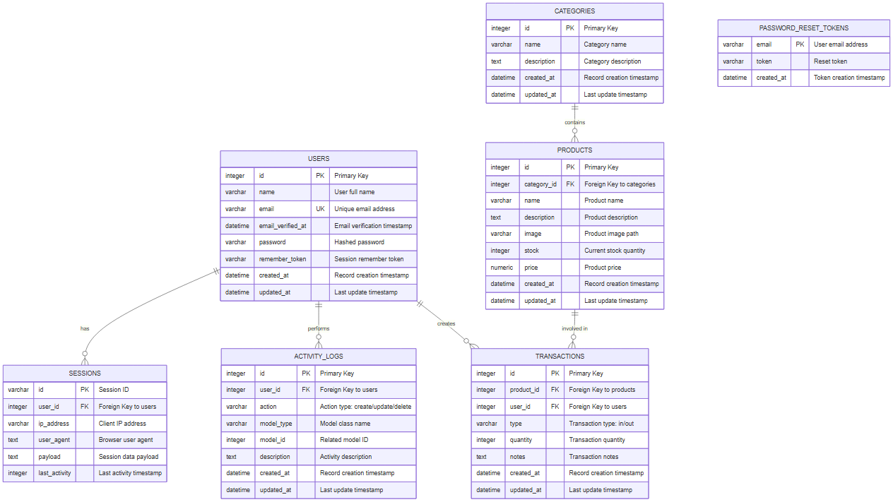
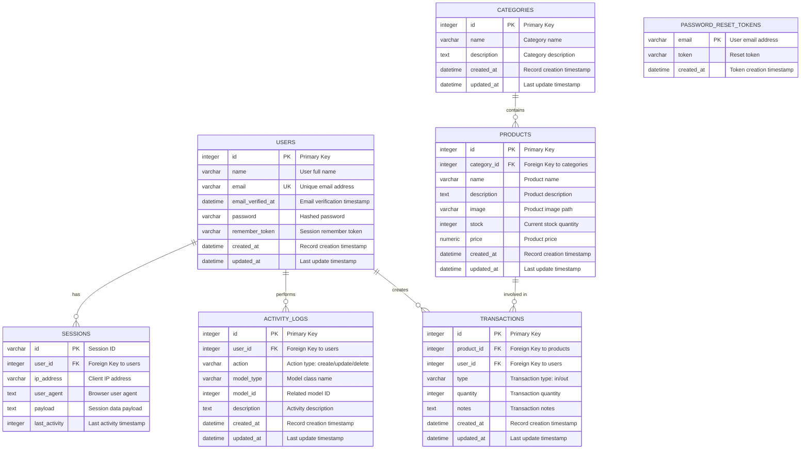

# InvenTrack - Entity Relationship Diagram

## Overview

This document describes the database structure for the InvenTrack Inventory Management System.

## ERD Diagram



## Tables Description

### Core Business Tables

| Table           | Description                                                    |
| --------------- | -------------------------------------------------------------- |
| `users`         | System users who can manage inventory and perform transactions |
| `categories`    | Product categories for organizing inventory                    |
| `products`      | Inventory items with stock tracking                            |
| `transactions`  | Stock in/out movements with full audit trail                   |
| `activity_logs` | System-wide activity logging for audit purposes                |

### System Tables

| Table                   | Description                  |
| ----------------------- | ---------------------------- |
| `sessions`              | User session management      |
| `password_reset_tokens` | Password reset functionality |
| `cache`                 | Application cache storage    |
| `jobs`                  | Queue job management         |
| `failed_jobs`           | Failed queue job tracking    |

## Relationships

```
USERS (1) -----> (many) TRANSACTIONS     : User creates transactions
USERS (1) -----> (many) ACTIVITY_LOGS    : User performs activities
USERS (1) -----> (many) SESSIONS         : User has sessions

CATEGORIES (1) -----> (many) PRODUCTS    : Category contains products

PRODUCTS (1) -----> (many) TRANSACTIONS  : Product involved in transactions
```

## Mermaid Source



## Table Details

### users

Primary table for user authentication and authorization.

| Column            | Type     | Constraints        | Description                  |
| ----------------- | -------- | ------------------ | ---------------------------- |
| id                | integer  | PK, AUTO_INCREMENT | Primary key                  |
| name              | varchar  | NOT NULL           | User's full name             |
| email             | varchar  | UNIQUE, NOT NULL   | User's email address         |
| email_verified_at | datetime | NULLABLE           | Email verification timestamp |
| password          | varchar  | NOT NULL           | Bcrypt hashed password       |
| remember_token    | varchar  | NULLABLE           | "Remember me" session token  |
| created_at        | datetime | NOT NULL           | Record creation timestamp    |
| updated_at        | datetime | NOT NULL           | Last update timestamp        |

### categories

Product categorization for inventory organization.

| Column      | Type     | Constraints        | Description               |
| ----------- | -------- | ------------------ | ------------------------- |
| id          | integer  | PK, AUTO_INCREMENT | Primary key               |
| name        | varchar  | NOT NULL           | Category name             |
| description | text     | NULLABLE           | Category description      |
| created_at  | datetime | NOT NULL           | Record creation timestamp |
| updated_at  | datetime | NOT NULL           | Last update timestamp     |

### products

Core inventory items with stock tracking.

| Column      | Type     | Constraints                | Description               |
| ----------- | -------- | -------------------------- | ------------------------- |
| id          | integer  | PK, AUTO_INCREMENT         | Primary key               |
| category_id | integer  | FK -> categories.id        | Foreign key to category   |
| name        | varchar  | NOT NULL, INDEX            | Product name              |
| description | text     | NULLABLE                   | Product description       |
| image       | varchar  | NULLABLE                   | Product image file path   |
| stock       | integer  | NOT NULL, INDEX, DEFAULT 0 | Current stock quantity    |
| price       | numeric  | NOT NULL                   | Product price             |
| created_at  | datetime | NOT NULL                   | Record creation timestamp |
| updated_at  | datetime | NOT NULL                   | Last update timestamp     |

### transactions

Stock movement records (in/out).

| Column     | Type     | Constraints        | Description                     |
| ---------- | -------- | ------------------ | ------------------------------- |
| id         | integer  | PK, AUTO_INCREMENT | Primary key                     |
| product_id | integer  | FK -> products.id  | Foreign key to product          |
| user_id    | integer  | FK -> users.id     | Foreign key to user who created |
| type       | varchar  | NOT NULL, INDEX    | Transaction type: 'in' or 'out' |
| quantity   | integer  | NOT NULL           | Transaction quantity            |
| notes      | text     | NULLABLE           | Transaction notes/reason        |
| created_at | datetime | NOT NULL, INDEX    | Record creation timestamp       |
| updated_at | datetime | NOT NULL           | Last update timestamp           |

### activity_logs

System-wide activity audit logging.

| Column      | Type     | Constraints        | Description                               |
| ----------- | -------- | ------------------ | ----------------------------------------- |
| id          | integer  | PK, AUTO_INCREMENT | Primary key                               |
| user_id     | integer  | FK -> users.id     | Foreign key to user who performed action  |
| action      | varchar  | NOT NULL           | Action type: 'create', 'update', 'delete' |
| model_type  | varchar  | NOT NULL, INDEX    | Eloquent model class name                 |
| model_id    | integer  | INDEX              | Related model's primary key               |
| description | text     | NOT NULL           | Human-readable activity description       |
| created_at  | datetime | NOT NULL, INDEX    | Record creation timestamp                 |
| updated_at  | datetime | NOT NULL           | Last update timestamp                     |

## Indexes

### products

- `products_name_index` - For name search optimization
- `products_stock_index` - For low stock queries

### transactions

- `transactions_type_index` - For filtering by type
- `transactions_created_at_index` - For date range queries

### activity_logs

- `activity_logs_model_type_model_id_index` - Composite index for polymorphic queries
- `activity_logs_created_at_index` - For chronological queries

## Foreign Key Constraints

All foreign keys use `ON DELETE CASCADE` to maintain referential integrity:

- `products.category_id` -> `categories.id`
- `transactions.product_id` -> `products.id`
- `transactions.user_id` -> `users.id`
- `activity_logs.user_id` -> `users.id`
